# HCLUS

## Indice

* [1. Introduzione](#1-introduzione)
  * [1.1. Modifiche e nuove feature rispetto alla base](#11-modifiche-e-nuove-feature-rispetto-alla-base)
* [2. Compilazione](#2-compilazione)
  * [2.1. Prerequisiti](#21-prerequisiti)
  * [2.2. Compilare il progetto](#22-compilare-il-progetto)
* [3. Documentazione](#3-documentazione)
  * [3.1. Backend](#31-backend)
  * [3.2. Protocollo](#32-protocollo)
  * [3.3. Diagramma delle classi](#33-diagramma-delle-classi)
  * [3.4. Generazione del JavaDoc](#34-generazione-del-javadoc)
  * [3.5. Istruzioni per l'uso](#35-istruzioni-per-luso)
* [4. Contatti](#4-contatti)

## 1. Introduzione

Un sistema client-server per la scoperta di un dendrogramma di cluster con un algoritmo di [clustering agglomerativo](https://it.wikipedia.org/wiki/Clustering_gerarchico) 
scritto completamente in Java.

### 1.1. Modifiche e nuove feature rispetto alla base

* **Protocollo binario personalizzato per la comunicazione**

  Questo permette l'indipendenza del client rispetto al server (e viceversa) dando la possibilità di svilupparne altri 
  senza l'essere vincolati dalla rappresentazione dei dati utilizzata dalla serializzazione di Java.
* **_Backend_ rivisitato** (si veda la sezione [3.1. Backend](#31-backend)).
* **Nuovi metodi per il calcolo della distanza fra cluster**

  Il server fornito dispone di altri 5 metodi per il calcolo della distanza in più rispetto alla base, questo
  permette di scegliere quello più appropriato fra i presenti in base al dataset che si sceglie di utilizzare.
* **Nuove funzionalità sul server**

  Il server dispone di altre funzionalità per facilitare l'uso del software tra cui:
  * possibilità di elencare i dataset disponibili;
  * possibilità di elencare i clustering salvati;
  * possibilità di elencare i metodi di distanza disponibile;
  
  Questo, oltre a semplificare l'utilizzo del software, lo rende anche indipendente dal client e viceversa, 
  infatti, potremmo avere un server che supporta solo alcuni dei metodi per il calcolo della distanza o ne utilizza 
  di nuovi. 
* **Meccanismo di salvataggio astratto**

  Il meccanismo di salvataggio non viene specificato a livello implementativo, lasciando spazio al server di poter 
  scegliere dove meglio salvarlo.

  Nel caso del server qui implementato, i clustering hanno un formato specifico per il nome e vengono tutti salvati 
  nella directory `clusterings` per motivi di sicurezza. Altri server, però, potrebbero, per esempio, decidere di 
  utilizzare il DBMS per salvarli o qualsiasi altro meccanismo di salvataggio. Ciò che deve essere garantito è che,
  una volta salvato, sia reperibile in futuro dal client.
* **Inclusione del dataset [IRIS](https://en.wikipedia.org/wiki/Iris_flower_data_set)**

  Il dataset IRIS viene incluso in quanto è noto per essere un tipico caso di test per molti algoritmi di 
  classificazione come quello di clustering agglomerativo.
* **Interfaccia grafica e visualizzazione del dendrogramma**

  Un client con una GUI semplice rende l'utilizzo del software semplice anche per gli utenti meno esperti in ambito 
  informatico. Inoltre questa permette di visualizzare i dendrogrammi e navigarli in modo tale da rendere 
  l'operazione di scoperta di pattern dei dati più semplice.

## 2. Compilazione

### 2.1. Prerequisiti

Per poter compilare il progetto c'è bisogno di un [JDK](https://www.oracle.com/java/), di seguito alcune possibilità:
* [GraalVM](https://www.graalvm.org/): consigliata per migliori performance
* [OpenJDK](https://adoptium.net/)

Il server avrà poi bisogno del DBMS [MySQL](https://mysql.com/) per memorizzare i dataset.

> **NOTA**: È richiesto che l'eseguibile `mysql` sia disponibile nella variabile d'ambiente `PATH`.

### 2.2. Compilare il progetto

Prima di iniziare a compilare il progetto va creato il file `dmbs_root_password` nella cartella `assets` che deve contere
la password dell'utente `root` del DBMS.

> **NOTA**: Se non si ha intenzione di utilizzare il server si può lasciare il file vuoto.

Per compilare il progetto bisogna eseguire il seguente comando:
* **Linux**
```
$ ./gradlew build
```
* **Windows**
```
$ .\gradlew.bat build
```

Se si ha intenzione di compilare solo il client o il server si può invece eseguire il seguente comando:
* **Linux**
```
$ ./gradlew :<server-client>:build
```
* **Windows**
```
$ .\gradlew.bat :<server-client>:build
```
sostituendo a `<server-client>`, `server` o `client` in base a ciò che si desidera compilare.

## 3. Documentazione

### 3.1. Backend

Si veda: [docs/Backend.md](docs/Backend.md)

### 3.2. Protocollo

Si veda: [docs/Protocollo.md](docs/Protocollo.md).

### 3.3. Diagramma delle classi

Si veda: [docs/diagramma_classi.png](docs/diagramma_classi.png).

### 3.4. Generazione del JavaDoc

È possibile generare la documentazione del sorgente con il seguente comando:
* **Linux**
```
$ ./gradlew javadocAll
```
* **Windows**
```
$ .\gradlew.bat javadocAll
```
A questo punto la documentazione si troverà in `docs/javadoc` e sarà possibile visualizzarla aprendo il file `index.html` 
in un browser.

### 3.5. Istruzioni per l'uso

#### Server

Per poter avviare il server bisognerà prima eseguire il comando:
* **Linux**
```
$ ./gradlew installDatabase
```
* **Windows**
```
$ .\gradlew.bat installDatabase
```
che configurerà il DBMS per poter essere utilizzato dal server, in particolare creerà un utente `hclus_user` il 
quale avrà accesso al database `hclus_db` che conterrà alcuni dataset di esempio:
* `examples_1` e `examples_2`: due dataset molto piccoli e ridotti utilizzati inizialmente per testare l'algoritmo;
* `empty_examples` e `no_numbers`: due dataset non validi per testare i casi di errore;
* `iris`: il dataset IRIS menzionato sopra.

Se, in futuro, si desidera portare il DBMS al suo stato iniziale si potrà eseguire il comando:
* **Linux**
```
$ ./gradlew uninstallDatabase
```
* **Windows**
```
$ .\gradlew.bat uninstallDatabase
```

Dopodiché possiamo eseguire il server con il seguente comando:
```
$ java -jar server/build/libs/server-1.0.jar <port>
```
dove `port` è il numero della porta dove si metterà in ascolto il server.

Una volta avviato il server nella console si riceveranno vari messaggi di informazioni/errore in base alle 
connessioni da parte di client e delle loro richieste.

#### Client

Per poter avviare il client possiamo eseguire il seguente comando:
```
$ java -jar client/build/libs/client-1.0.jar
```

All'esecuzione del client verrà mostrata la seguente finestra

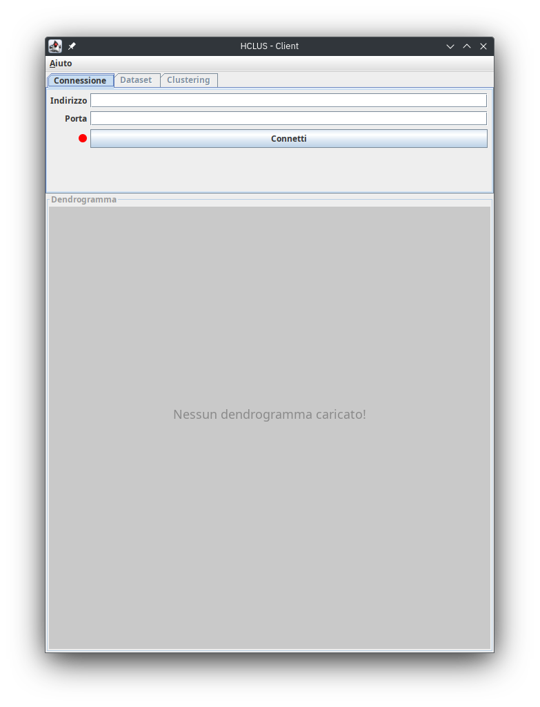

in cui possiamo notare la presenza di tre elementi distinti:
* un menu che contiene una sola voce (`Aiuto`) la quale mostrerà altre due voci: `Comandi dendrogramma` e `Informazioni 
  sull'applicazione`. La prima, in particolare, mostrerà i comandi che è possibile utilizzare nella sezione di 
  visualizzazione del dendrogramma (che verrà approfondita dopo);
* una sezione divisa in tre schede, di cui solo la prima (`Connessione`) è accessibile;
* una sezione con titolo `Dendrogramma`.

##### Connessione

Una volta inseriti i dati richiesti per la connessione, premendo il pulsante `Connetti` un tentativo di 
connessione al server avrà inizio e, se tutto va a buon fine, l'icona di stato della connessione (a sinistra del pulsante) 
diventerà verde e la scheda `Dataset` diventerà accessibile.

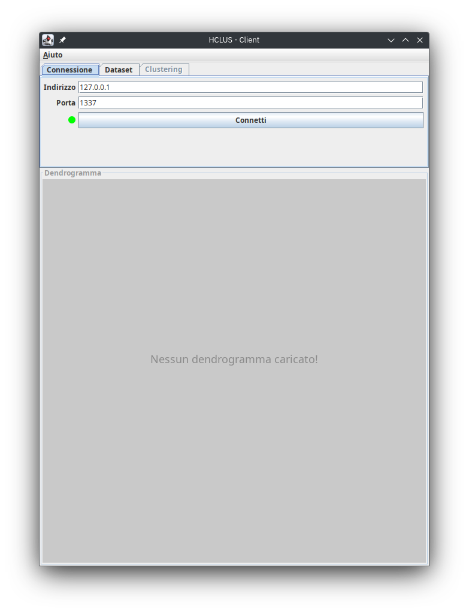

> **NOTA**: Nel caso in cui la connessione non dovesse andare a buon fine allora verrà mostrata una finestra di dialogo 
> che descrive cosa non è andato a buon fine.
>
> 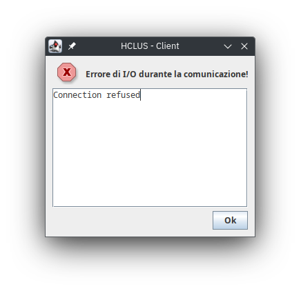

> **NOTA**: Nel caso in cui si decida di connettersi a un altro server (e una connessione è già aperta) la 
> connessione precedente verrà chiusa.

##### Dataset

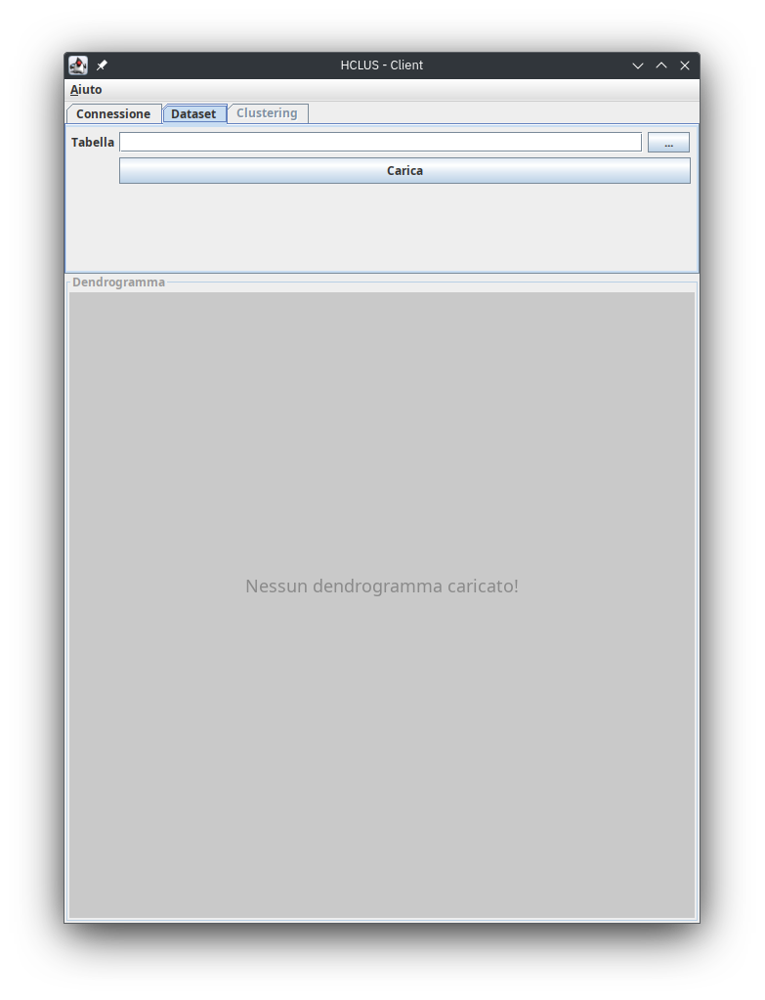

Nella sezione `Dataset` possiamo scegliere un dataset da caricare sul server. Nel caso in cui ne 
conosciamo già il nome possiamo inserirlo nel campo di testo, altrimenti possiamo utilizzare il pulsante alla sua 
destra che visualizzerà una finestra di dialogo che contiene un elenco di quelli disponibili sul server.

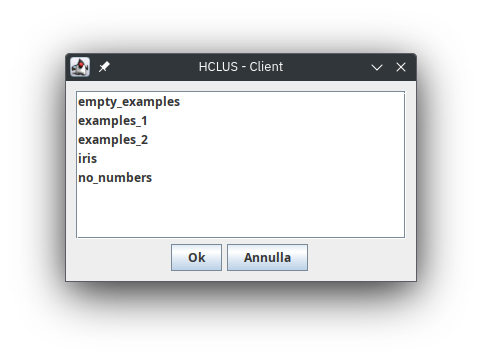

> **NOTA**: Nel caso in cui la lettura dei dataset disponibili sul server non dovesse andare a buon fine verrà 
> mostrata una finestra di dialogo che descrive cosa non è andato a buon fine.
> 
> 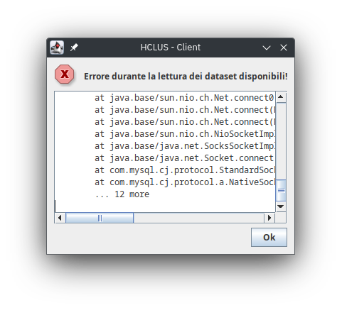

> **NOTA**: Nel caso in cui non ci siano dei dataset disponibili sul server allora viene mostrata una finestra di 
> dialogo che lo comunica.
> 
> 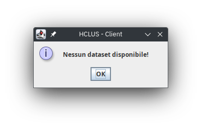

A questo punto possiamo selezionare uno degli elementi della lista (con un doppio click del mouse o con un singolo 
click del mouse seguito dall pressione del pulsante di conferma) e il suo nome comparirà nel campo di testo.
A quel punto premendo il pulsante `Carica` avrà inizio un tentativo di caricamento del dataset selezionato e, se 
tutto va a buon fine, allora verranno mostrate le informazioni sul dataset caricato e la scheda `Clustering` diventerà 
accessibile.

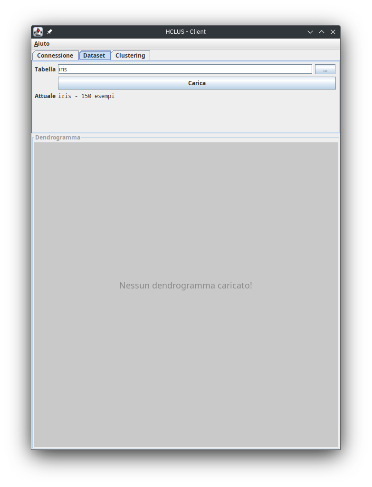

> **NOTA**: Nel caso in cui il caricamento del dataset non dovesse andare a buon fine allora verrà mostrata una 
> finestra di dialogo che descrive cosa non è andato a buon fine.
> 
> 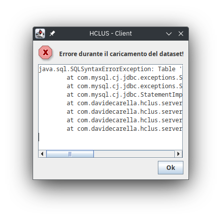

> **NOTA**: Nel caso in cui si decida di caricare un altro dataset (e un dataset è già stato caricato) si perde 
> quello precedente.

##### Clustering

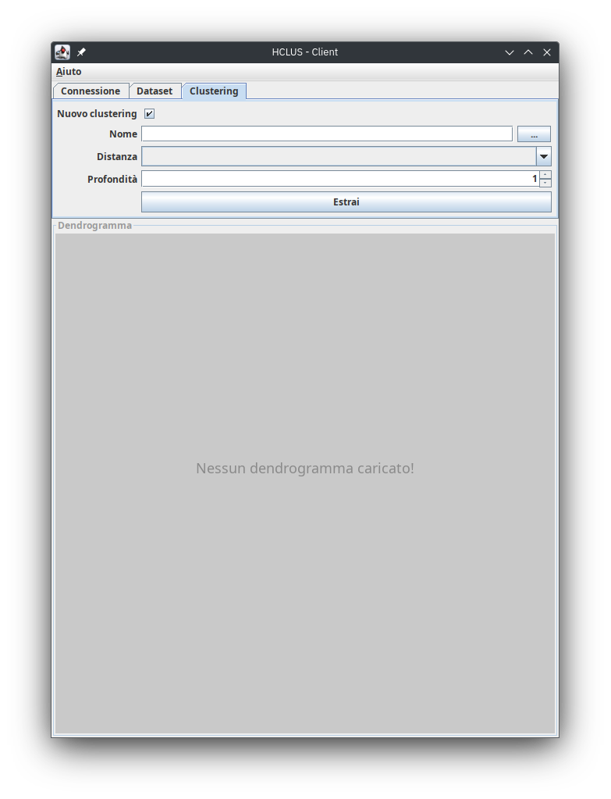

Nella sezione `Clustering` possiamo estrarre un clustering sul server o caricarne uno estratto in precendenza.
Per prima cosa possiamo selezionare, tramite una casella di controllo, se vogliamo estrarre un nuovo clustering o 
caricarne uno, inserire i campi richiesti e premere il pulsante per estrarre il clustering

Nel caso in cui si stia caricando un clustering e non si conosca il nome di quello che si vuole caricare lo si può 
selezionare con il pulsante alla destra del campo di testo che mostrerà una finestra di dialogo con la lista dei 
clustering disponibili sul server.

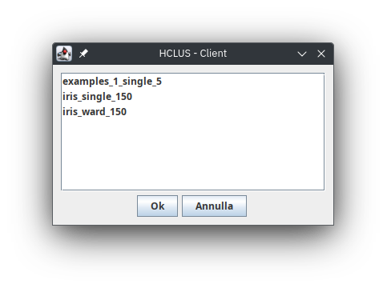

> **NOTA**: Nel caso in cui la lettura dei clustering disponibili sul server non dovesse andare a buon fine verrà 
> mostrata una finestra di dialogo che lo comunica.
> 
> 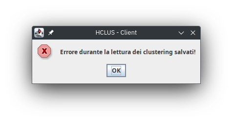

> **NOTA**: Nel caso in cui non ci siano clustering disponibili verrà mostrata una finestra di dialogo che lo comunica.
>
> 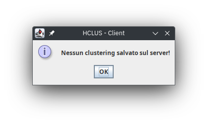

A questo punto possiamo selezionare uno degli elementi della lista (con un doppio click del mouse o con un singolo 
click del mouse seguito dalla pressione del pulsante di conferma) e il suo nome comparirà nel campo di testo.

Premuto il pulsante per estrarre, un tentativo di estrazione del clustering avrà inizio e, se tutto va a buon fine, 
allora verrà visualizzato il dendrogramma associato al clustering.

> **NOTA**: Nel caso in cui l'estrazione del clustering non dovesse andare a buon fine allora verrà mostrata una 
> finestra di dialogo che descrive cosa non è andato a buon fine.
> 
> 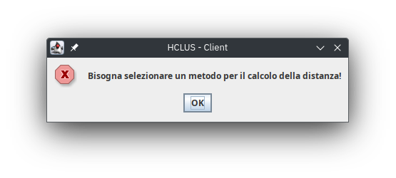
> 

> **NOTA**: Nel caso in cui si decida di estrarre un altro clustering (e un clustering era già stato estratto) si 
> perde quello estratto in precedenza.

##### Dendrogramma

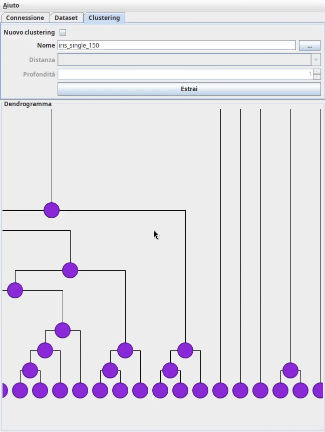

Nella sezione di visualizzazione del dendrogramma verrà visualizzato il dendrogramma associato al clustering estratto.
Il dendrogramma è un albero binario i cui nodi sono i cluster del clustering generato e per ogni cluster i figli 
rappresentano i cluster che sono stati uniti per ottenere il padre.

L'utente può navigare il dendrogramma in diversi modi:
* può muovere il dendrogramma tenendo premuta la rotellina del mouse e muovendo il mouse;
* può zoomare intorno al mouse tenendo premuto `CTRL` sulla tastiera e scrollando la rotellina del mouse;
* può ruotare il dendrogramma premendo `R` sulla tastiera.

Inoltre è possibile ottenere informazioni su un cluster selezionandolo con il tasto sinistro del mouse. Facendo 
questo verrà mostrato in basso a destra un tooltip che contiene la lista degli esempi che contiene, qualora la lista 
dovesse essere lunga si può utilizzare la rotellina del mouse per scrollarla.

## 4. Contatti

Il progetto è stato realizzato da:
* [Davide Carella](https://github.com/ITHackerstein) (mail universitaria: d.carella12@studenti.uniba.it)