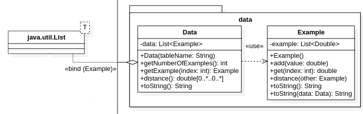

# HCLUS

## Indice

* [1. Introduzione](#1-introduzione)
* [2. Compilazione](#2-compilazione)
  * [2.1. Prerequisiti](#21-prerequisiti)
  * [2.2. Compilare il progetto](#22-compilare-il-progetto)
* [3. Documentazione](#3-documentazione)
  * [3.1. Diagramma delle classi](#31-diagramma-delle-classi)
  * [3.2. Generazione del JavaDoc](#32-generazione-del-javadoc)
  * [3.3. Istruzioni per l'uso](#33-istruzioni-per-luso)
* [4. Contatti](#4-contatti)

## 1. Introduzione

Un sistema client-server per la scoperta di un dendrogramma di cluster con un algoritmo di [clustering agglomerativo](https://it.wikipedia.org/wiki/Clustering_gerarchico) scritto completamente in Java.

## 2. Compilazione

### 2.1. Prerequisiti

Per poter compilare il progetto c'è bisogno di un [JDK](https://www.oracle.com/java/), di seguito alcune possibilità:
* [GraalVM](https://www.graalvm.org/): consigliata per migliori performance
* [OpenJDK](https://adoptium.net/)

Il server avrà poi bisogno del DBMS [MySQL](https://mysql.com/) per memorizzare i dataset.

### 2.2. Compilare il progetto

Prima di iniziare a compilare il progetto va creato il file `dmbs_root_password` nella cartella `assets` che deve contere
la password dell'utente `root` del DBMS.

> **NOTA**: se non si ha intenzione di utilizzare il server si può lasciare il file vuoto.

Per compilare il progetto bisogna eseguire il seguente comando:
* **Linux**
```
$ ./gradlew build
```
* **Windows**
```
$ .\gradlew.bat build
```

Se si ha intenzione di compilare solo il client o il server si può invece eseguire il seguente comando:
* **Linux**
```
$ ./gradlew :<server-client>:build
```
* **Windows**
```
$ .\gradlew.bat :<server-client>:build
```
sostituendo a `<server-client>`, `server` o `client` in base a ciò che si desidera compilare.

## 3. Documentazione

### 3.1. Diagramma delle classi

Si veda: [docs/diagramma_classi.png](docs/diagramma_classi.png).

Di seguito alcune sezioni del diagramma.

#### Package `client`


#### Package `data`



#### Package `distance`


#### Package `database`


#### Package `clustering`


#### Package `server`


#### Package `exceptions`


### 3.2. Generazione del JavaDoc

È possibile generare la documentazione del sorgente con il seguente comando:
* **Linux**
```
$ ./gradlew javadocAll
```
* **Windows**
```
$ .\gradlew.bat javadocAll
```
A questo punto la documentazione si troverà in `docs/javadoc` e sarà possibile visualizzarla aprendo il file `index.html` in un browser.

### 3.3. Istruzioni per l'uso

#### Server

Per poter avviare il server bisognerà prima eseguire il comando:
* **Linux**
```
$ ./gradlew installDatabase
```
* **Windows**
```
$ .\gradlew.bat installDatabase
```
che configurerà il DBMS per poter essere utilizzato dal server, in particolare creerà un utente `hclus_user` il
quale avrà accesso al database `hclus_db` che conterrà alcuni dataset di esempio:
* `examples_1` e `examples_2`: due dataset molto piccoli e ridotti utilizzati inizialmente per testare l'algoritmo;
* `empty_examples` e `no_numbers`: due dataset non validi per testare i casi di errore.

Se, in futuro, si desidera portare il DBMS al suo stato iniziale si potrà eseguire il comando:
* **Linux**
```
$ ./gradlew uninstallDatabase
```
* **Windows**
```
$ .\gradlew.bat uninstallDatabase
```

Dopodiché possiamo eseguire il server con il seguente comando:
```
$ java -jar server/build/libs/server-1.0.jar <port>
```
dove `port` è il numero della porta dove si metterà in ascolto il server. A questo punto abbiamo due casi:
* se la porta è valida allora vedremo il seguente output: 
* altrimenti vedremo: 

Quando un client si connetterà al server, verrà comunicato un messaggio con l'indirizzo IP del client.

Riceveremo un messaggio simile quando il client chiuderà la connessione con il server.


Durante tutto il ciclo di vita del client si potrebbero incontrare casi eccezionali di errore che verranno comunicati in
output.


#### Client

Per poter avviare il client possiamo eseguire il seguente comando:
```
$ java -jar client/build/libs/client-1.0.jar <address> <port>
```
dove `address` è l'indirizzo del server e `port` è la porta dove questo è in ascolto.

Una volta eseguito vedremo il seguente output:

a questo punto il client ci chiede di inserire il nome della tabella memorizzata sul server da cui caricare i dati.
Abbiamo varie possibilità:
* la tabella è valida (esiste, non è vuota e contiene esclusivamente attributi numerici): 
  
* la tabella non esiste
  
* la tabella esiste ma è vuota
  
* la tabella esiste ma contiene attributi non numerici
  
* il server non riesce a connettersi al DBMS
  
 
Come possiamo notare nel caso la tabella inserita non è valida allora viene chiesta nuovamente fino a quando non ne viene
inserita una valida.
Una volta inserita una tabella valida possiamo vedere che viene mostrato un menu che ci chiede che operazione vuole
eseguire:
1. caricare un dendrogramma da un file (memorizzato sul server)
2. creare un nuovo dendrogramma a partire dal database
 
e ci viene chiesto di scegliere una delle due opzioni. A questo punto:
* se inseriamo `1` allora viene mostrato il seguente output: 
  
  come possiamo notare, ora ci viene chiesto di inserire il percorso del file (sul server) del dendrogramma che vogliamo
  caricare:
  * se il file esiste ed è valido, allora viene mostrata una rappresentazione testuale del dendrogramma
    
  * se il file non esiste, allora viene mostrato un messaggio d'errore che lo comunica
    
  * se il file esiste ma non è valido, allora viene mostrato un messaggio d'errore che lo comunica
    
  * se il file esiste, è valido ma contiene un dendrogramma non compatibile con i dati caricati allora viene mostrato un
    messaggio d'errore che lo comunica
    
* se inseriamo `2` allora viene mostrato il seguente output:
  
  come possiamo notare, ora ci viene chiesto di inserire la profondità del dendrogramma che vogliamo creare
  
  adesso, invece, ci viene chiesto di inserire il tipo di distanza che si vuole utilizzare:
  * se inseriamo `1` allora verrà utilizzata la distanza single-link
  * se inseriamo `2` allora verrà utilizzata la distanza average-link
  * se inseriamo una qualsiasi altra sequenza di caratteri diversa da `1` o `2` ci viene chiesto di reinserirla fino a 
    quando non sarà valida
    

  Nel caso in cui la distanza che abbiamo inserito è valida allora ci viene mostrata una rappresentazione testuale del 
  dendrogramma generato e ci viene chiesto il percorso del file (sul server) sul quale salvare il dendrogramma
  
  Una volta inserito il percorso il server proverà a salvare il file su quel percorso.

  Abbiamo un ultimo caso in cui la profondità inserita dal client sia non valida, in tal caso il server ci manderà un
  messaggio d'errore.
  
* se inseriamo una qualsiasi altra sequenza di caratteri diversa da `1` o `2` verrà chiesto di reinserire la scelta fino a 
  quando questa non sarà valida
  

## 4. Contatti

Il progetto è stato realizzato da:
* [Davide Carella](https://github.com/ITHackerstein) (mail universitaria: d.carella12@studenti.uniba.it)